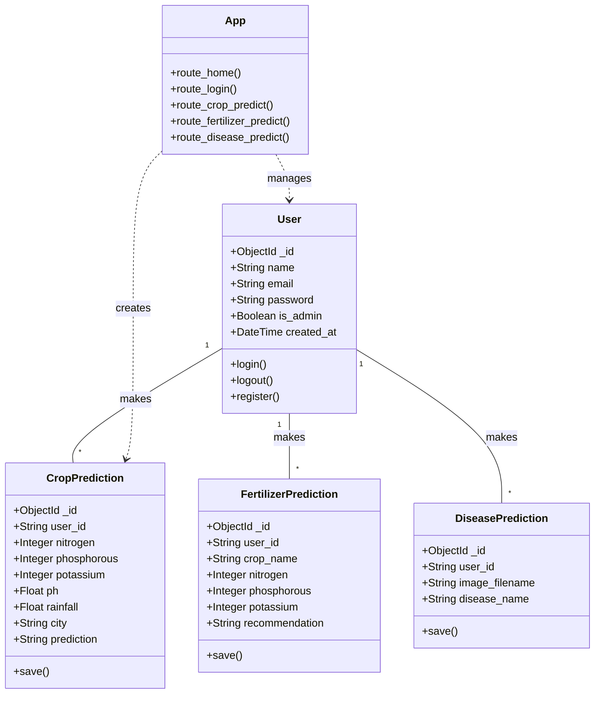
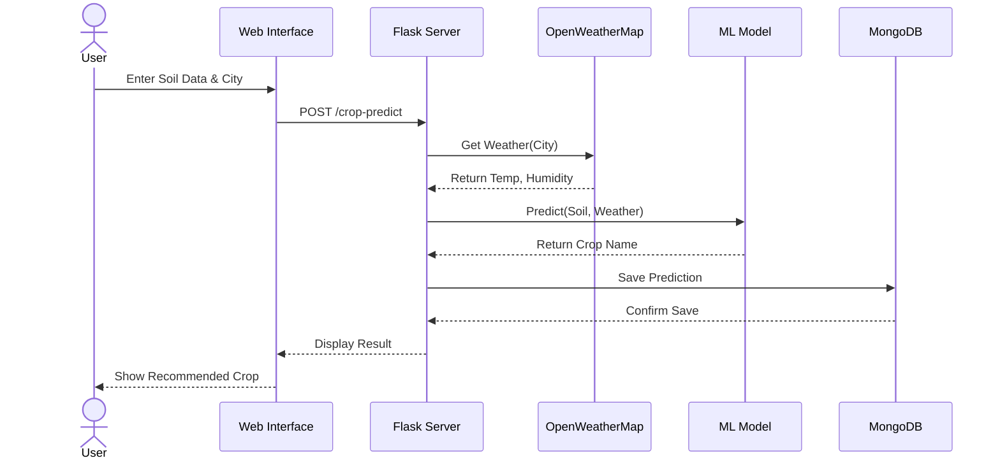
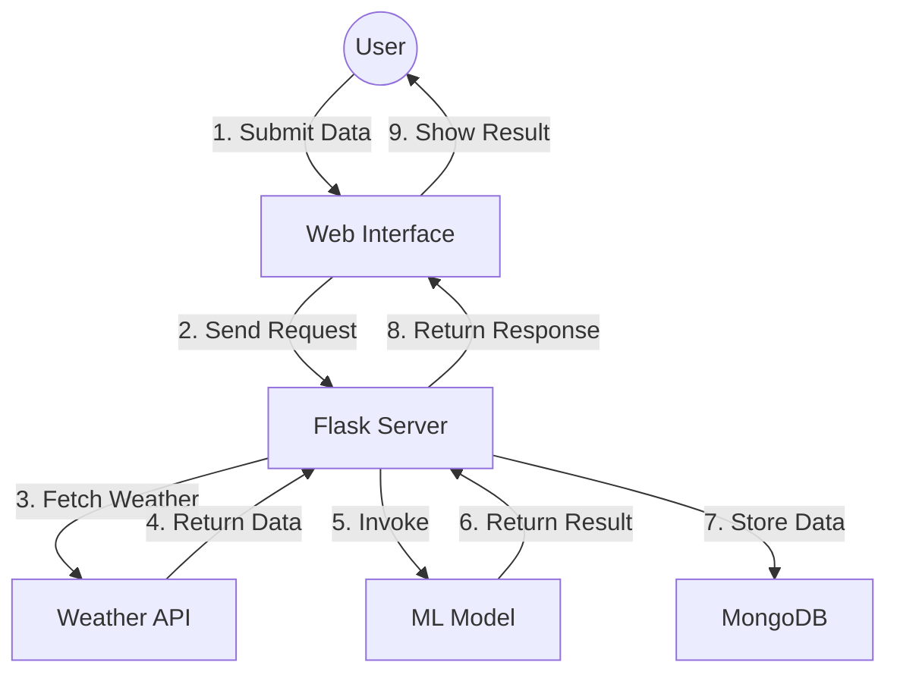
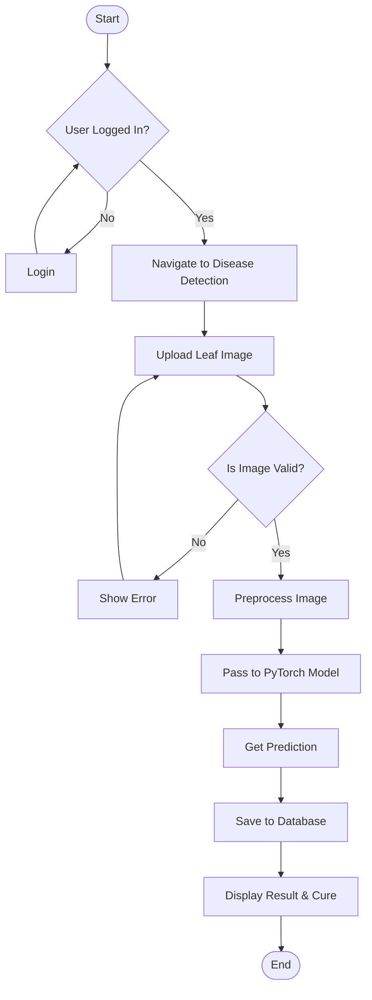
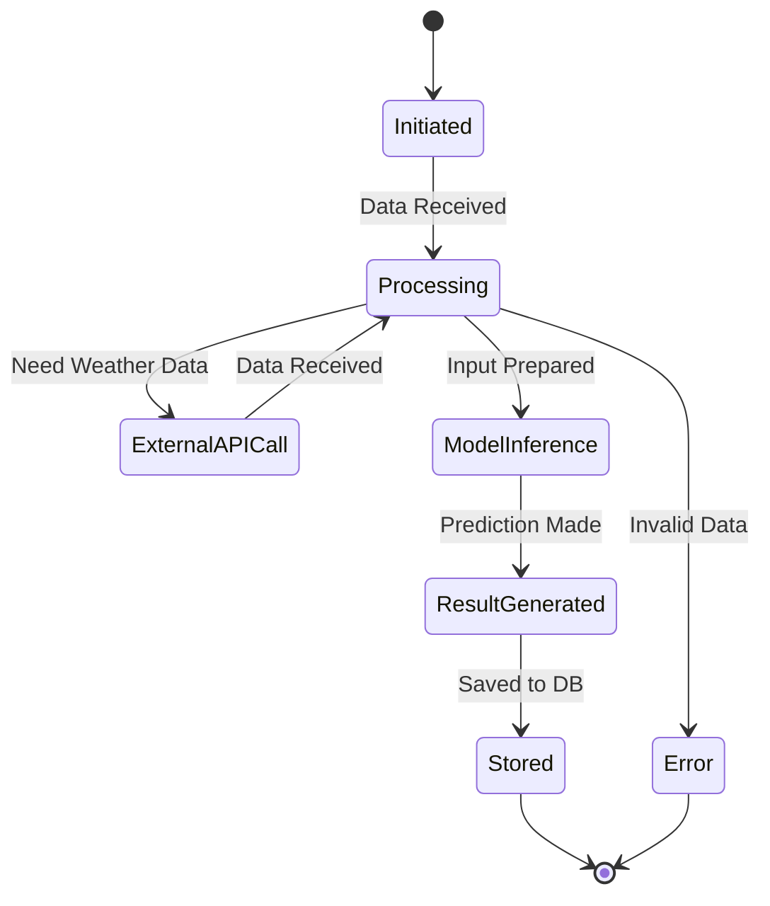
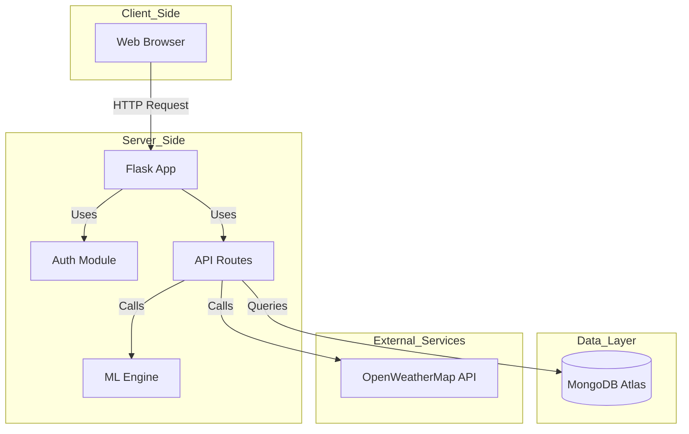
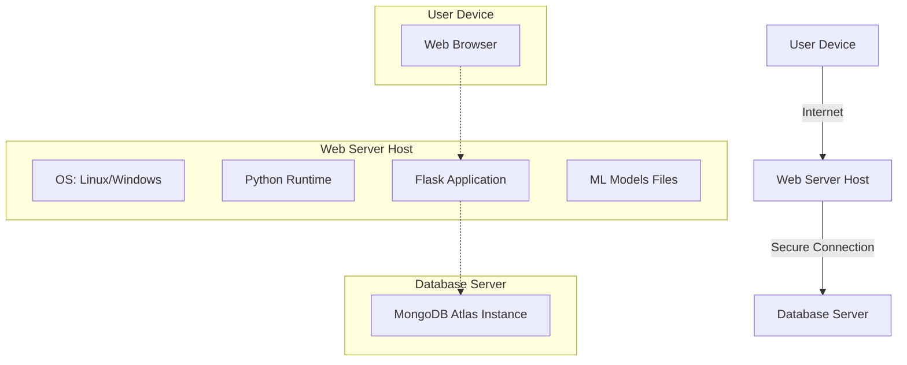

# AgriSense AI - UML Diagrams

This document contains the UML diagrams for the AgriSense AI application, represented in Mermaid.js syntax. You can view these diagrams using a Mermaid viewer or by rendering this markdown file on GitHub.

## 1. Use Case Diagram
Describes the interactions between actors (Farmer, Admin) and the system.

```mermaid
useCaseDiagram
    actor "Farmer" as F
    actor "Admin" as A
    package "AgriSense AI System" {
        usecase "Register" as UC1
        usecase "Login" as UC2
        usecase "Logout" as UC3
        usecase "View Dashboard" as UC4
        usecase "Get Crop Recommendation" as UC5
        usecase "Get Fertilizer Recommendation" as UC6
        usecase "Detect Plant Disease" as UC7
        usecase "View History" as UC8
        usecase "Manage Users" as UC9
        usecase "View System Stats" as UC10
    }
    F --> UC1
    F --> UC2
    F --> UC3
    F --> UC4
    F --> UC5
    F --> UC6
    F --> UC7
    F --> UC8
    A --> UC2
    A --> UC3
    A --> UC9
    A --> UC10
    A --> UC4
    A --> UC8
```

## 2. Class Diagram
Shows the static structure of the system, including classes, attributes, and relationships.



## 3. Sequence Diagram
Illustrates the flow of interactions for the "Crop Recommendation" scenario.



## 4. Collaboration Diagram
Shows the structural organization of objects that send and receive messages.



## 5. Activity Diagram
Depicts the workflow for the "Disease Detection" process.



## 6. State Chart Diagram
Shows the states of a `PredictionRequest` object during its lifecycle.



## 7. Component Diagram
Illustrates the physical components of the system and their dependencies.



## 8. Deployment Diagram
Shows the hardware nodes and the execution environments.


